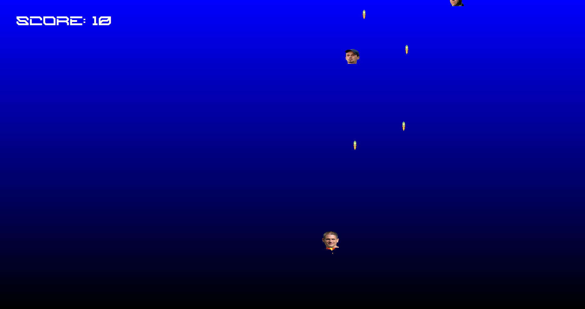

Prison Break FireShip Game


https://github.com/user-attachments/assets/bb7ccc3e-ee10-4af1-8ae7-5ff23b3a3547




This is Prison Break FireShip, a small retro arcade game made with C++ and Qt/QML.
You control a ship, shoot enemies, and try to survive as long as you can.

It’s also a learning project made step-by-step to help beginners understand how to connect C++ logic with QML graphics.

Game Features
- Move your ship left and right
- Shoot bullets at enemies
- Enemies spawn randomly
- Explosion effect when enemies are hit
- Score counter
- Game over screen with restart option

## 🛠️ Setup Instructions
1. Download / Clone the project
```bash
git clone https://github.com/OguzSahin58/PrisonBreakFireShipGame.git
cd PrisonBreakFireShipGame
```

3. Install Qt
You need Qt 6.2 or newer
Make sure you have Qt Quick and CMake installed

4. Build the project
```bash
mkdir build
cd build
cmake ..
make
```

6. Run the game
```bash
./PrisonBreakFireShipGame
```

## 📂 Project Structure

```
├── Bullet.cpp/h + Bullet.qml      # Bullet movement + visuals
├── Enemy.cpp/h + Enemy.qml        # Random enemy logic and sprite
├── Controller.cpp/h               # Main game logic and backend
├── main.qml + main.cpp            # App entry point
├── CMakeLists.txt                 # Build config
├── assets/                        # All PNGs, GIFs and pixel art
└── README.md                      # You’re here!
```

---
## 🧠 Key Concepts You’ll Learn

- How to connect C++ backend with QML frontend
- How to use signals and slots in Qt
- How to create animations and simple game loops
- How to handle keyboard input in QML

Made with C++ and Qt/QML
